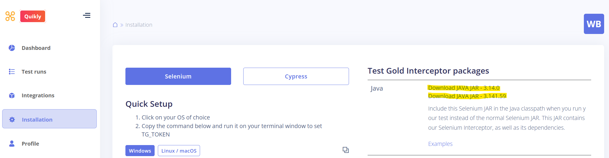
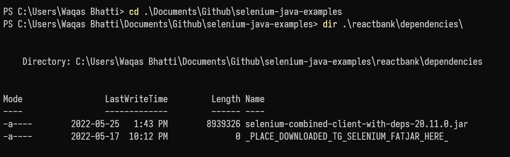
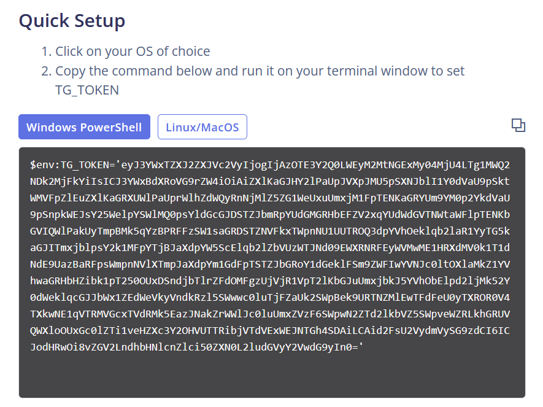
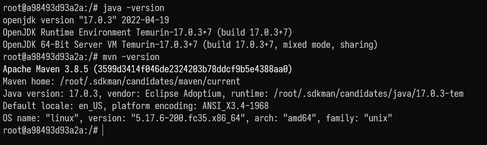
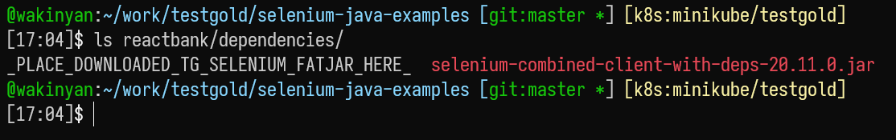

# selenium-java-examples

Java Selenium testing provides thorough and functioning test cases that can test every aspect of your application.
The TestGold service generates robust selectors, heals broken selectors, and helps maintains your Java Selenium tests.

1. Run your tests using our enhanced Selenium, transparently replacing normal Selenium.
2. TestGold learns from a previously working example of your test run on your webapp.
2. Make code changes to your webapp; this may break the selectors you were previously using.
3. Run your tests again using our enhanced Selenium. Selectors that were broken will be healed and
   the test run will complete as expected.

## Get the TestGold Selenium JAR

To set up the example here, you will need to download a TestGold Selenium JAR from the TestGold webapp.
Login to your account, then navigate to the "Installation" tab:



Click on the "Download JAR" button that corresponds to the Selenium version you use normally.

Clone this repository and save the downloaded JAR to the `reactbank/dependencies` folder.

## Run the example on Windows

### Make sure Java and Maven are installed

First, you will need a JDK and Maven. We recommend [Adoptium's Temurin distribution](https://adoptium.net/).

- Download and install the JDK `.msi` file. Make sure that the "Set JAVA_HOME" option is checked when you install the package.
- Download the binary distribution of Maven from the [Maven website](https://dlcdn.apache.org/maven/maven-3/3.8.4/binaries/apache-maven-3.8.4-bin.zip).
- Unzip this and copy the `maven-3.xx-bin` folder to a place on your `C:` drive (we recommend using a directory in `C:\Users\your-username`.).

Add a `MAVEN_HOME` environment variable and the path to the `mvn` binary to your `PATH`. [See this page for help](https://mkyong.com/maven/how-to-install-maven-in-windows/):

- Click on the "Start" button and then type "Advanced system settings" and click on the "View advanced system settings" Control Panel item.
- Click on "Environment Variables" in the dialog that comes up.
- Click on the "New..." button under the "User variables for YOUR_USERNAME" box. Add the path to where you saved the Maven unzipped folder as the value of the `MAVEN_HOME` environment variable.
- Select "Path" in the "User variables for YOUR_USERNAME" box and click on "Edit...". Click on "New" in the box that pops up. Then type: `%MAVEN_HOME%\bin` and hit Enter to add this item to your `Path` environment variable.

### Run the example

We recommend using PowerShell for the examples. Click on the Start Menu, type `powershell` and hit Enter to launch the PowerShell console.

Navigate to where you cloned this repository and make sure the TestGold Selenium JAR is present in the expected folder:



Change to the `reactbank` directory.

```
cd reactbank
```

Make sure Maven validates the current package installs:

```
mvn clean
mvn validate
```

Then, add the `TG_TOKEN` environment variable. Copy the token from the "Installations" tab of the TestGold webapp:



Then, set up the environment variable in PowerShell:

```
$env:TG_TOKEN='copied token goes here'
```

Then, run the two examples provided as PowerShell batch files.

1. Run `test_original_app.ps1` first. This simulates the TestGold service learning from a test run against your webapp in its original state.
2. Run `test_modified_app.ps1` next. This runs the exact same Selenium test steps against a modified version of the same webapp. Some selectors are no longer valid in this version, so they will no longer work. The TestGold service detects these broken selectors and heals them automatically.

## Run the example on MacOS/Linux

### Make sure Java and Maven are installed

We recommend using [SDKman](https://sdkman.io/) to install Java and Maven. Install the SDKMan CLI:

```
 curl -s "https://get.sdkman.io" | bash
```

Restart your shell and then obtain Java and Maven.

```
sdk install java
sdk install maven
```

Running the following commands:

```
java -version
mvn -version
```

should result in something like the following output:



### Run the example

Navigate to where you cloned this repository and make sure the TestGold Selenium JAR is present in the expected folder:



Change to the `reactbank` directory.

```
cd reactbank
```

Make sure Maven validates the current package installs:

```
mvn clean
mvn validate
```

Then, add the `TG_TOKEN` environment variable. Copy the token from the "Installations" tab of the TestGold webapp:


Then, set up the environment variable in PowerShell:

```
export TG_TOKEN='copied token goes here'
```

Then, run the two examples provided as shell scripts.

1. Run `test_original_app.sh` first. This simulates the TestGold service learning from a test run against your webapp in its original state.
2. Run `test_modified_app.sh` next. This runs the exact same Selenium test steps against a modified version of the same webapp. Some selectors are no longer valid in this version, so they will no longer work. The TestGold service detects these broken selectors and heals them automatically.
